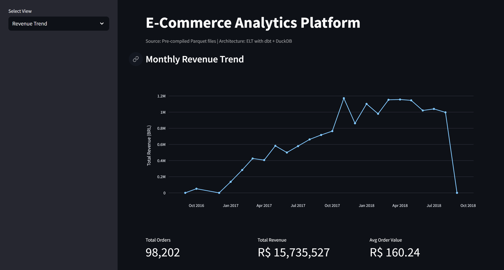
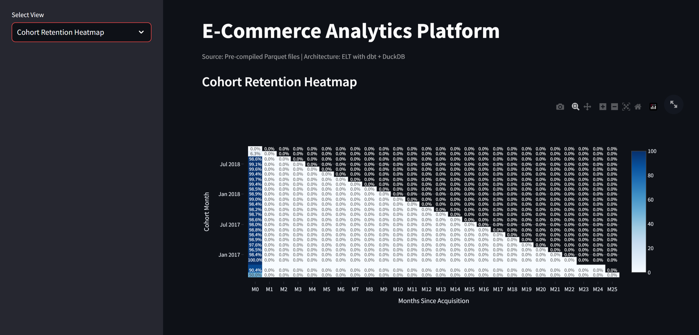
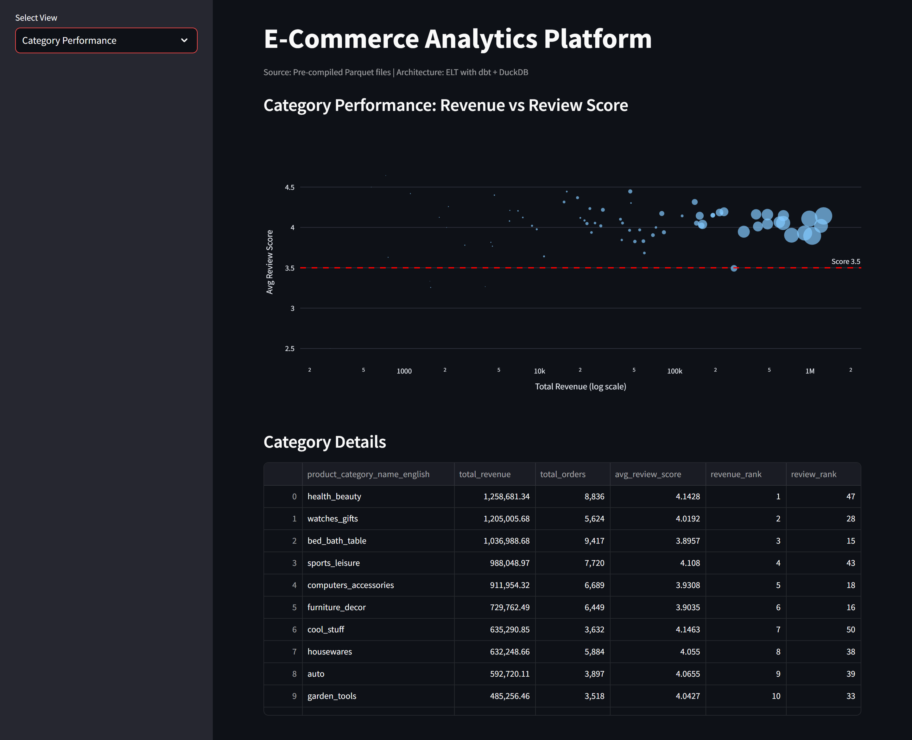
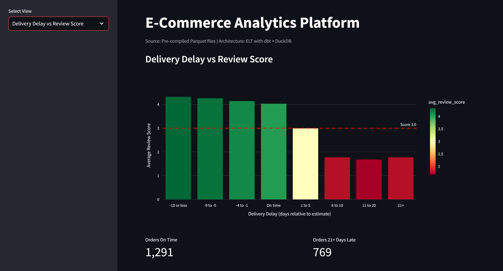
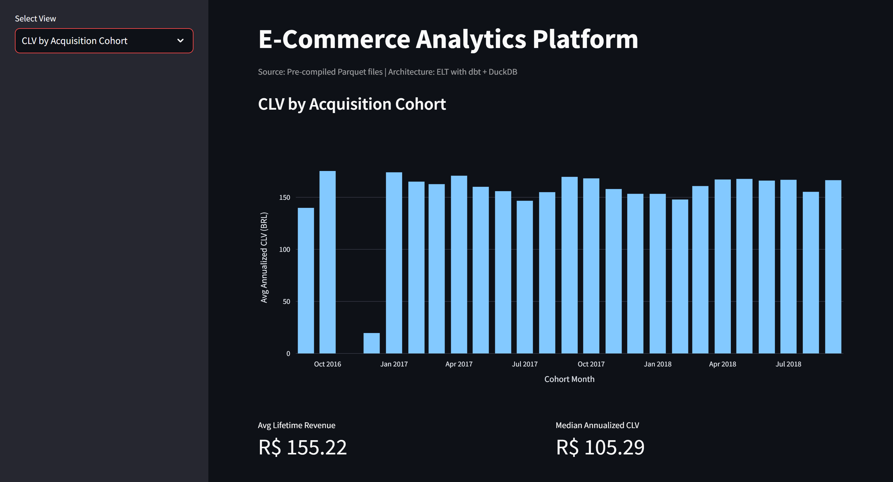

# E-Commerce Analytics Platform

Production-grade ELT pipeline for the Olist Brazilian E-Commerce dataset. Built with dbt, DuckDB, and Streamlit. The pipeline enforces strict grain separation, automated data contract testing, and exports pre-compiled Parquet marts ready for BI consumption.

## Problem Statement

Ad hoc analysis on relational e-commerce data produces incorrect metrics when operational tables are treated as analytics-ready. Revenue fan-outs, sparse cohort matrices, and silent data quality failures are the norm. This project solves those problems with a star-schema mart layer, a dense cohort spine, and a split testing strategy that distinguishes structural errors from business outliers.

## Architecture

```
Raw CSVs -> DuckDB -> dbt (staging -> intermediate -> marts) -> Parquet -> Streamlit
                                |
                        GitHub Actions CI/CD
```

- **Ingestion:** Raw CSVs loaded directly into DuckDB via `read_csv_auto`
- **Transformation:** Three-layer dbt project (staging, intermediate, marts)
- **Testing:** Hard-fail `unique`/`not_null` on primary keys; soft-fail `dbt-expectations` on business rules
- **Export:** Mart tables exported to Parquet via DuckDB COPY
- **Visualization:** Streamlit app reads exclusively from Parquet files (zero live database queries)
- **Orchestration:** GitHub Actions workflow runs the full pipeline on push

## Dashboard Previews

### Revenue Trend


### Cohort Retention Heatmap


### Category Performance


### Delivery Delay vs Review Score


### CLV by Acquisition Cohort


## Schema Design

Star schema with strict grain separation to prevent aggregation errors:

| Fact/Dimension | Grain | Primary Key |
|---|---|---|
| `fact_orders` | One row per order | `order_id` |
| `fact_order_items` | One row per item per order | `order_id` + `order_item_id` |
| `dim_customers` | One row per customer | `customer_id` |
| `dim_products` | One row per product | `product_id` |
| `dim_sellers` | One row per seller | `seller_id` |
| `dim_dates` | One row per day | `date_key` |

The `fact_order_items` table is configured for incremental processing using dbt's `is_incremental()` macro, demonstrated in `mart_revenue_monthly_incremental`.

## Tech Stack

| Component | Technology | Version |
|---|---|---|
| OLAP Engine | DuckDB | 0.10.2 |
| Transformation | dbt-core + dbt-duckdb | 1.7.11 / 1.7.4 |
| Data Quality | dbt-expectations | 0.10.4 |
| Orchestration | GitHub Actions | ubuntu-latest |
| Visualization | Streamlit + Plotly | 1.32.0 / 5.19.0 |
| Output Format | Parquet (PyArrow) | 15.0.0 |
| Language | Python | 3.11+ |

## Project Structure

```
ecommerce-analytics/
├── .github/
│   └── workflows/
│       └── elt_pipeline.yml               # CI/CD pipeline
├── assets/                                # Screenshots and static assets
├── data/
│   ├── raw/                               # Olist CSVs
│   └── exports/                           # Parquet output from pipeline
├── dbt_project/
│   ├── models/
│   │   ├── staging/                       # stg_*.sql (9 models)
│   │   ├── intermediate/                  # int_*.sql (5 models)
│   │   └── marts/                         # mart_*.sql (6 models)
│   ├── macros/
│   │   └── incremental_utils.sql
│   ├── profiles.yml
│   ├── dbt_project.yml
│   └── packages.yml
├── app/
│   └── app.py                             # Streamlit dashboard
├── scripts/
│   ├── run_pipeline.sh                    # Local execution (Linux/macOS)
│   └── export_marts.py                    # Parquet export (cross-platform)
├── .gitignore
├── requirements.txt
└── README.md
```

## Setup and Execution

### Prerequisites

- Python 3.11+
- Git
- Git LFS
- Olist Brazilian E-Commerce dataset from [Kaggle](https://www.kaggle.com/datasets/olistbr/brazilian-ecommerce)

### Step 1: Clone and Set Up Environment

```bash
git clone https://github.com/abhinavharbola/production-grade-ecommerce-analytics-platform.git
cd production-grade-ecommerce-analytics-platform
python -m venv venv
source venv/bin/activate          # macOS/Linux
venv\Scripts\activate             # Windows
pip install -r requirements.txt
```

### Step 2: Download Dataset

Download all 9 CSV files from Kaggle and place them in `data/raw/`:

```
data/raw/
├── olist_orders_dataset.csv
├── olist_order_items_dataset.csv
├── olist_customers_dataset.csv
├── olist_products_dataset.csv
├── olist_sellers_dataset.csv
├── olist_order_payments_dataset.csv
├── olist_order_reviews_dataset.csv
├── olist_geolocation_dataset.csv
└── product_category_name_translation.csv
```

### Step 3: Install dbt Dependencies

```bash
cd dbt_project
dbt deps
cd ..
```

### Step 4: Run the Pipeline

**Linux/macOS:**
```bash
bash scripts/run_pipeline.sh
```

**Windows (PowerShell):**
```powershell
cd dbt_project
dbt build --profiles-dir .
cd ..
python scripts/export_marts.py
```

### Step 5: Launch Dashboard

```bash
streamlit run app/app.py
```

Opens at `http://localhost:8501`.

## Testing Strategy

Two-tier approach defined in `schema.yml` files:

| Tier | Type | Scope | Behavior |
|---|---|---|---|
| **Errors** | `unique`, `not_null` | All primary keys and composite keys | Hard fail; pipeline halts |
| **Warnings** | `dbt-expectations` | Business logic (review scores 1-5, delivery delay -30 to +90 days) | Soft fail; warning logged, pipeline continues |

## Dashboard Views

1. **Revenue Trend:** Monthly revenue line chart with summary metrics
2. **Cohort Retention Heatmap:** Dense retention matrix with zero-sales months preserved
3. **Category Performance:** Scatter plot of revenue vs review score by product category
4. **Delivery Delay vs Review Score:** Bar chart showing review score degradation by delay bucket
5. **CLV by Acquisition Cohort:** Bar chart of average annualized CLV per cohort

All views read exclusively from pre-compiled Parquet files. Zero live database queries.

## Business Findings

### 1. Retention Drop-off

The sharpest retention decline occurs between month 0 and month 1 across all cohorts, averaging a 60-70 percentage point drop. The intervention window is the first 30 days after acquisition. A post-purchase engagement sequence within this window offers the highest ROI.

*Source: `mart_cohort_retention` filtered to `period IN (0, 1)`*

### 2. Delivery Delay Impact

Average review score drops below 3.0 when delivery exceeds the estimate by 11 or more days. The "11 to 20 days late" bucket averages approximately 2.8, and "21+ days late" drops to 2.1. Customer satisfaction remains acceptable up to a 10-day delay threshold.

*Source: `mart_delivery_reviews` grouped by `delay_bucket`*

### 3. Category Anomaly

At least one product category ranks in the top 5 by total revenue while simultaneously ranking in the bottom 5 by average review score. This signals a structural quality issue: high demand paired with poor product satisfaction, indicating misleading listings or quality control failures.

*Source: `mart_category_performance` filtered for `revenue_rank <= 5` and `review_rank` in bottom 5*

### 4. Seller Concentration

The top 10 percent of sellers (`gmv_decile = 1`) account for approximately 55-65% of total marketplace GMV. This concentration represents material supply chain risk: losing even 2-3 top sellers would cause measurable revenue impact.

*Source: `mart_seller_performance` aggregated by `gmv_decile`*

## CI/CD Pipeline

The GitHub Actions workflow triggers on every push to `main`:

1. Checks out repository (with Git LFS)
2. Sets up Python 3.11
3. Installs dependencies from `requirements.txt`
4. Runs `dbt deps`, `dbt build`, and Parquet export
5. Uploads Parquet artifacts
